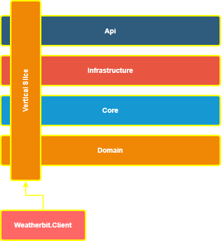

 

# Vertical Slice Architecture WeatherApi

REST API solution demonstrates how to create API with Vertical Slice Architecture, minimal API and various of design patterns.  

Example API allows to get actual/forecast weather data by location from [Weatherbit](https://www.weatherbit.io/) throught [RapidAPI](https://rapidapi.com) and also allow's to add favorite locations into [in memory database](https://learn.microsoft.com/en-us/ef/core/providers/in-memory/?tabs=dotnet-core-cli) and then get weather data by stored (favorites) locations.

## Menu
* [Get Started](#get-started)
* [Motivation](#motivation)
* [Architecture](#architecture)
* [Technologies](#technologies)

## Get Started
1. Register on [RapidAPI](https://rapidapi.com)
2. Subscribe Weatherbit (its for free) and go to API Documentation
3. In API documentation copy (from Code Snippet) **X-RapidAPI-Key**, **X-RapidAPI-Host** and put them to appsettings.json file in WeatherAPI project
```json
  "Weatherbit": {
    "BaseUrl": "https://weatherbit-v1-mashape.p.rapidapi.com",
    "XRapidAPIKey": "value from code snippet",
    "XRapidAPIHost": "value from code snippet"
  }
```
4. Run Weather.API 

### Try it using .http file (VS2022)
 * Go to Tests/Debug folder and open **debug-tests.http** file (in VS2022)
 * Send request

## Motivation
Main motivation is to write practical example of simple API using Vertical Slice Architecture and then compare it to same API designed by Clean Architecture.

## Architecture



## Comparsion of Vertical Slice Architecture and Clean Architecture 

## Technologies
* [ASP.NET Core 8](https://learn.microsoft.com/en-us/aspnet/core/introduction-to-aspnet-core?view=aspnetcore-8.0)
* [Entity Framework Core InMemory](https://learn.microsoft.com/en-us/ef/core/providers/in-memory/?tabs=dotnet-core-cli)
* [AutoMapper](https://github.com/AutoMapper/AutoMapper)
* [FluentResuls](https://github.com/altmann/FluentResults)
* [Validot](https://github.com/bartoszlenar/Validot)
* [GuardClauses](https://github.com/ardalis/GuardClauses)
* [Moq](https://github.com/moq/moq4)
* [Xunit](https://github.com/xunit/xunit)
